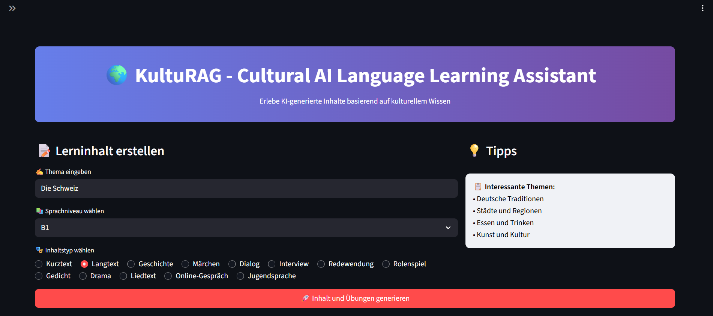
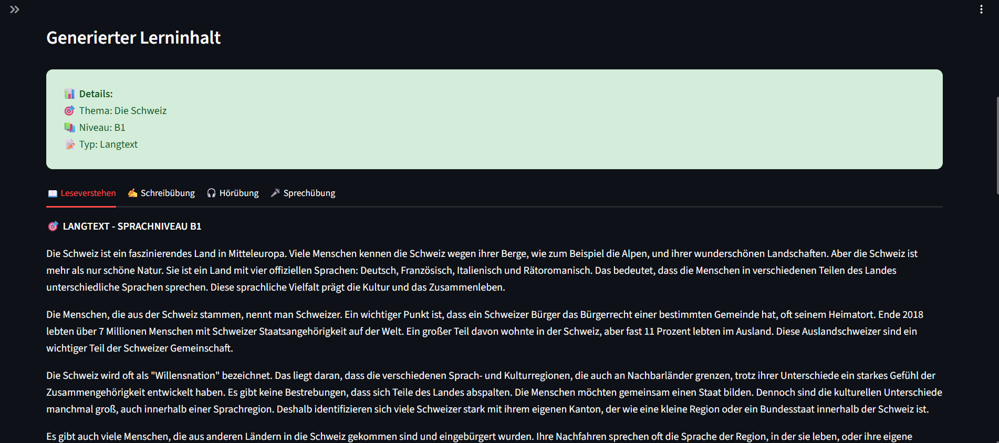
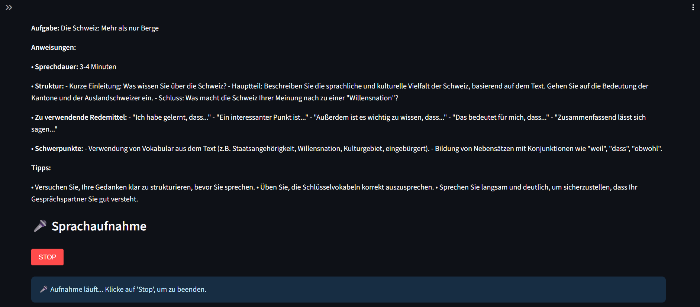
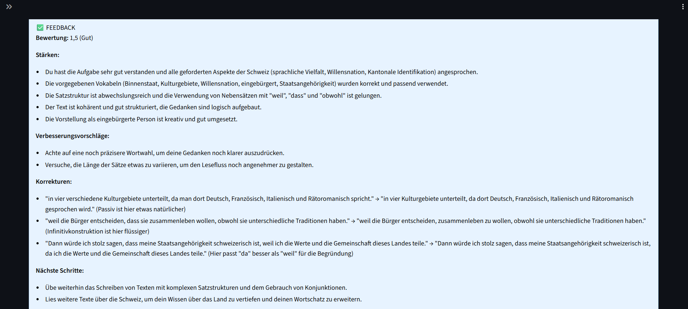
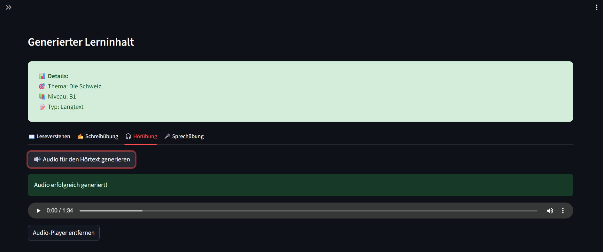

# KultuRAG – Ein KI-gestützter Sprachlern-Assistent

KI-gestützter Sprachlern-Assistent für Deutsch, der eine RAG-Pipeline nutzt, um interaktive, kulturell fundierte Übungen zu erstellen.

[Deutsch](README.de.md) | [English](README.md)

Dieses Projekt ist eine Webanwendung, die als kultureller und interaktiver Assistent für Deutschlernende konzipiert ist. Anstatt generischer Inhalte erstellt KultuRAG Lernmaterialien, die auf kulturellem Kontext basieren und durch authentische Sprachbeispiele angereichert sind.

---

## Konzept & Architektur

Die Anwendung nutzt einen **RAG**-Ansatz, um die Qualität und Relevanz der generierten Inhalte sicherzustellen:

- **Kontextanreicherung:** Eine Anfrage des Nutzers wird zunächst an die Wikipedia-API gesendet, um kulturell relevante Informationen auf Deutsch zu erhalten.  
- **Authentische Sprachbeispiele:** Parallel dazu durchsucht ein Retriever eine Qdrant-Vektordatenbank. Diese Datenbank wurde mit Tausenden von authentischen deutschen Sätzen aus dem Tatoeba-Korpus bestückt, um dem Modell Beispiele für natürlichen Sprachgebrauch zu liefern.  
- **Inhaltsgenerierung:** Die gesammelten Informationen werden zusammen mit der Nutzeranfrage in einen strukturierten Prompt für das Gemini-Modell via Vertex AI verpackt. Das LLM generiert daraufhin einen kompletten didaktischen Block: Lesetext, Vokabelliste, interaktive Übung und weitere Übungsformate (Schreiben, Hören, Sprechen).  
- **Interaktivität:** Die Anwendung bietet Text-to-Speech- und Speech-to-Text-Funktionen und gibt dem Lernenden pädagogisches Feedback zu seinen Antworten.  

---

## Angewendete Technologien & Fähigkeiten

- **Frameworks & Bibliotheken:** Python, LangChain, Hugging Face (Transformers, Datasets, TRL, PEFT), Google Vertex AI, PyTorch, FastAPI, Streamlit, Pandas, Uvicorn, MatPlotLib, Seaborn, Torch, Gradio  
- **Architekturen & Techniken:** Retrieval-Augmented Generation, Agentic-AI  
- **LLMs:** Google Gemini  

---

## Infrastruktur & Tools

- **Vektordatenbanken:** Qdrant
- **APIs:** Google Cloud (Speech-to-Text, Text-to-Speech), Wikipedia
- **Deployment:** Google Colab, Ngrok, Streamlit, FastAPI, GitHub

---

## Demo

